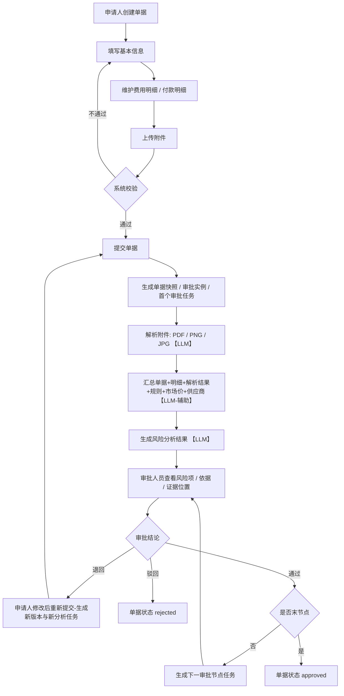
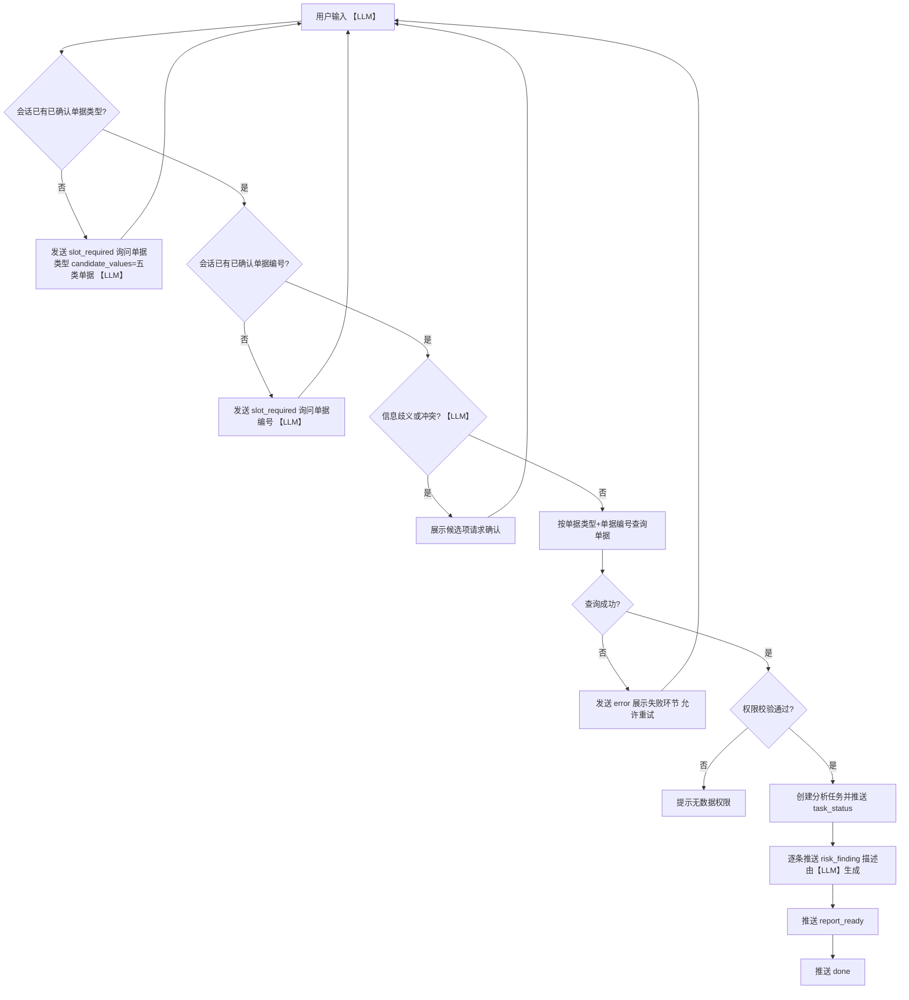
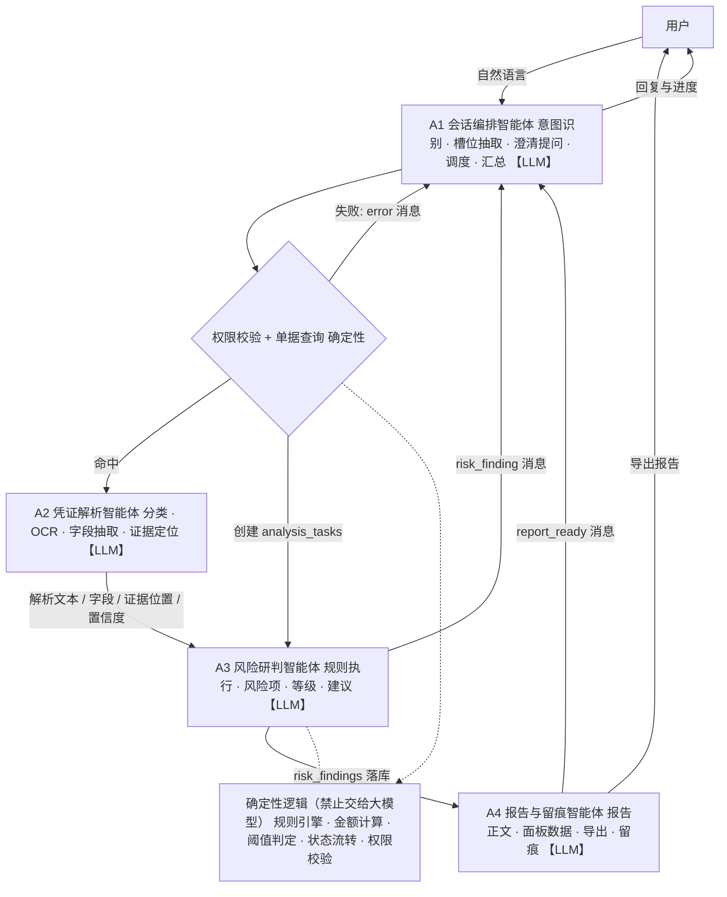

# 财务单据智能风险审核系统 · 产品需求文档（PRD）

| 项目 | 内容 |
|---|---|
| 文档名称 | 财务单据智能风险审核系统 产品需求文档 |
| 文档编号 | PRD-FA-2.7 |
| 版本 | v1.0 |
| 状态 | 待评审 |
| 编写日期 | 2026-09-12 |
| 对应需求章节 | 2.7 财务单据智能风险审核系统 |
| 字段定义基线 | `schema/financial_document.py`（五类单据数据结构，本文档字段与之对齐） |

---

## 1. 项目概述

### 1.1 背景与问题

当前财务单据审核依赖人工逐张核对，存在四类典型问题：

- **看不全**：单据结构化字段、明细行、附件（发票 / 合同 / 行程单 / 付款依据 / 费用明细）分散在不同载体，人工很难一次性把金额链条对齐。
- **对不上**：单据总金额、明细合计、发票含税金额、合同金额、付款金额五个口径互不闭环，差异靠肉眼发现。
- **判不准**：费用标准、市场价区间、消费行为规律、供应商风险属于隐性知识，依赖审核人经验，标准不统一。
- **追不溯**：审核结论缺少数据来源、计算过程和操作留痕，事后审计困难。

### 1.2 项目目标

实现一个**独立运行**的财务单据智能风险审核系统，覆盖单据创建、附件管理、审批流转、风险分析、人工复核、报告导出和操作审计七个环节，形成"录入 → 解析 → 分析 → 审批 → 留痕"的闭环。

系统以**多智能体协同**方式实现：由会话编排、凭证解析、风险研判、报告留痕四个智能体分工承担"理解 / 抽取 / 归纳 / 表达"四类工作；**金额计算、规则阈值判定、状态流转与权限校验保持确定性实现，不交由大模型承担**（设计原则与职责边界见第 20 章）。

### 1.3 交付形式

| 交付物 | 内容说明 |
|---|---|
| 可运行前端 | 登录页、工作台、单据管理 / 编辑 / 详情、附件解析、风险分析、金额核对、供应商、流程配置、规则配置、审核记录 |
| 可运行后端 | 认证权限、会话、单据、明细、附件、审批流程、文档解析、规则引擎、智能分析、供应商、报告、审核、日志共 13 个模块 |
| 多智能体协同 | 4 个智能体（会话编排 / 凭证解析 / 风险研判 / 报告留痕）的职责边界、调用链、大模型使用点与降级策略，见第 20 章 |
| 数据库初始化脚本 | 建表 + 索引 + 状态枚举 + 字典数据，支持一键初始化 |
| 文件存储模块 | 附件落盘、格式校验、访问控制、哈希校验、解析任务创建 |
| 示例数据 | 用户 / 角色 / 单据 / 明细 / 附件 / 发票 / 供应商 / 市场价 / 规则 / 审批流程，覆盖高中低风险各一类 |
| 接口说明 | 全部 REST 接口的路径、方法、权限、入参、出参、错误码 |
| 完整审核演示链路 | `单据创建 → 明细维护 → 附件上传 → 提交审批 → 附件解析 → 风险分析 → 审批处理 → 报告导出` |

### 1.4 范围边界

- **包含**：2.7.1 至 2.7.15 全部能力，独立部署，独立保存和管理用户、单据、附件、审批、分析、报告与审计数据。
- **不包含**：与外部 ERP / OA / 财务共享系统的实时对接；税务发票真实性联网查验；资金实际支付执行。以上如需对接，另立需求。
- **定位说明**：智能分析结论仅作为**审批辅助依据**，最终审批结果必须由具备权限的人员人工确认。

---

## 2. 术语表

| 术语 | 说明 |
|---|---|
| 单据 | 一次付款或报销申请的载体，本系统覆盖五类 |
| 单据快照 | 提交时刻单据全部字段与明细的不可变副本，用于版本追溯 |
| 审核会话 | 智能审核对话页中的一次多轮交互上下文，含槽位状态与消息记录 |
| 槽位（Slot） | 多轮交互中必须确认的关键信息，本系统至少包含 `document_type`、`document_no` |
| 分析任务 | 一次风险分析的执行实例，含分步骤状态与进度 |
| 风险项 | 单条风险结论，含类型、等级、实际值、参考值、阈值、证据、建议 |
| 证据位置 | 风险结论溯源到附件的页码与文本位置（BBox），用于证据对照 |
| 人工复核 | 审批人员对风险项确认 / 否定的动作，及对单据的最终审批意见 |

---

## 3. 用户角色与权限

### 3.1 角色定义

| 角色 | 角色码 | 核心职责 |
|---|---|---|
| 单据申请人 | `applicant` | 创建和编辑单据、维护明细、上传附件、提交审批、撤回未处理单据、查看本人单据状态 |
| 审批人员 | `approver` | 发起单据分析、查看风险面板、查看证据、填写复核意见、提交审批结果 |
| 财务人员 | `finance` | 查看全部单据分析结果、维护审核规则、维护市场价参考数据、维护供应商风险信息 |
| 系统管理员 | `admin` | 维护用户、角色、权限、审批流程、模型配置、系统参数 |

### 3.2 权限矩阵

| 能力 | applicant | approver | finance | admin |
|---|---|---|---|---|
| 创建 / 编辑本人草稿 | ✅ | — | — | — |
| 维护明细、上传附件 | ✅（本人单据） | — | — | — |
| 提交 / 撤回 / 作废 | ✅（本人单据） | — | — | — |
| 查看本人单据 | ✅ | ✅ | ✅ | ✅ |
| 查看全部单据 | — | ✅ | ✅ | ✅ |
| 发起风险分析 | — | ✅ | ✅ | ✅ |
| 查看风险面板与证据 | — | ✅ | ✅ | ✅ |
| 填写复核意见 | — | ✅ | — | — |
| 提交审批结果（通过 / 退回 / 驳回） | — | ✅ | — | — |
| 维护审核规则 | — | — | ✅ | ✅ |
| 维护市场价参考数据 | — | — | ✅ | ✅ |
| 维护供应商风险信息 | — | — | ✅ | ✅ |
| 维护用户 / 角色 / 权限 | — | — | — | ✅ |
| 维护审批流程 | — | — | — | ✅ |
| 维护模型配置 / 系统参数 | — | — | — | ✅ |

### 3.3 权限校验要求

- 所有单据查询、附件访问、风险分析和审批操作**必须校验登录状态与数据权限**。
- 数据权限规则：申请人默认仅可见本人单据；审批人员可见其审批任务范围内的单据；财务人员与系统管理员可见全部单据。
- 附件为高危资源：下载与预览需按"单据数据权限 + 附件归属单据"双重校验，禁止通过裸路径直接访问。
- 审批结果、风险项处理和规则变更**必须记录操作人、操作时间、变更内容**，写入 `audit_logs`。

---

## 4. 开发范围

### 4.1 系统能力

独立实现用户认证、角色权限、单据管理、附件管理、审批流程、规则配置、风险分析、报告管理和操作审计九大能力。

### 4.2 能力清单

| 分类 | 能力项 |
|---|---|
| 基础能力 | 用户登录、角色授权、审核会话、操作日志、任务状态管理、系统参数配置 |
| 单据能力 | 单据创建、编辑、复制、查询、提交、撤回、作废、结构化字段管理、明细管理 |
| 审批能力 | 审批流程配置、审批任务生成、审批意见提交、退回修改、通过、驳回、状态追踪 |
| 附件能力 | 附件上传、下载、预览、删除、格式校验、访问控制、解析状态管理 |
| 解析能力 | PDF / PNG / JPG 附件解析、OCR 识别、发票与合同关键字段提取、原文定位 |
| 分析能力 | 金额一致性校验、明细合计校验、开支合理性分析、市场价对比、消费异常识别、供应商风险分析 |
| 展示能力 | 风险概览、风险明细、证据对照、处理建议、人工复核记录 |

---

## 5. 单据与数据范围

### 5.1 五类单据

`对公付款单`、`预付款单`、`批量付款单`、`费用报销单`、`差旅报销单`。

### 5.2 共有结构化字段

| 字段 | 含义 | 类型 | 必填 | 备注 |
|---|---|---|---|---|
| `document_type` | 单据类型 | 枚举 | ✅ | 五类之一 |
| `document_no` | 单据编号 | 文本 | ✅ | 系统内唯一 |
| `applicant` | 申请人 | 用户 | ✅ | 引用 `users` |
| `applicant_department` | 申请部门 | 文本 | ✅ | — |
| `budget_department` | 预算部门 | 文本 | — | 可与申请部门不同，参与费用标准匹配 |
| `payee_name` | 收款单位 | 文本 | — | 报销类为报销人 |
| `payee_account` | 收款账号 | 文本 | — | 格式校验，参与重复收款识别 |
| `expense_category` | 费用类别 | 文本 | — | 参与费用标准匹配 |
| `amount` | 支出金额 | 金额 | — | 本次支出金额 |
| `total_amount` | 总金额 | 金额 | ✅ | 单据总金额 |
| `currency` | 币种 | 枚举 | ✅ | 默认 `CNY` |
| `apply_date` | 申请日期 | 日期 | ✅ | — |
| `reason_text` | 事由 | 文本 | — | — |

### 5.3 分类型补充字段

| 单据类型 | 补充字段 |
|---|---|
| 对公付款单 | 合同编号、供应商名称、付款比例、付款条件、计划付款日期 |
| 预付款单 | 合同编号、供应商名称、付款比例、付款条件、计划付款日期 |
| 批量付款单 | 付款明细、收款对象、单笔金额、批次总金额、付款笔数 |
| 费用报销单 | 费用明细、消费日期、消费地点、费用科目、报销金额 |
| 差旅报销单 | 出差地点、出差起止日期、交通费、住宿费、餐费、补贴金额 |

字段级约束：

| 字段 | 约束 | 校验时机 |
|---|---|---|
| 付款比例 | 取值 0~1 小数，入库统一归一化；`"30%"`、`"三成"` 需转换为 `0.3` | 保存草稿、提交审批 |
| 单笔金额合计 | 明细单笔金额合计必须等于批次总金额 | 提交审批、风险分析 |
| 付款笔数 | 必须等于付款明细行数 | 提交审批、风险分析 |
| 出差起止日期 | 结束日期不得早于开始日期 | 保存草稿、提交审批 |
| 差旅费合计 | 交通费 + 住宿费 + 餐费 + 补贴 = 总金额 | 提交审批、风险分析 |
| 费用明细合计 | 各明细报销金额合计 = 总金额 | 提交审批、风险分析 |

### 5.4 非结构化附件

| 维度 | 范围 |
|---|---|
| 附件类型 | 发票、合同、行程单、付款依据、费用明细（五类为必需覆盖，另可扩展"其他"） |
| 支持格式 | `PDF`、`PNG`、`JPG` |
| 解析产物 | 解析文本、字段提取结果、页码、文本位置、识别置信度 |
| 存储状态 | `uploading`、`stored`、`failed` |
| 解析状态 | `pending`、`parsing`、`succeeded`、`failed`、`manual_review` |

附件解析字段至少包含：

| 产物 | 说明 |
|---|---|
| 解析文本 `full_text` | 附件全文，供全文检索与人工核对 |
| 字段提取结果 `fields_json` | 发票代码、发票号码、金额、日期、销售方、购买方等 |
| 页码 `page_no` | 字段或文本所在页 |
| 文本位置 `evidence_positions_json` | 归一化坐标 BBox（左上原点，0~1） |
| 识别置信度 `confidence` | 附整体置信度与字段级置信度；低于 0.8 标记为待人工复核 |

---

## 6. 页面需求

### 6.1 页面总览

| 序号 | 页面 | 主要角色 | 核心目标 |
|---|---|---|---|
| 1 | 登录页 | 全部 | 用户名密码登录，进入审核工作台 |
| 2 | 单据管理页 | 申请人 / 审批人员 / 财务 | 查询、新建、复制、撤回、作废 |
| 3 | 单据编辑页 | 申请人 | 维护基本信息、费用明细、付款明细、附件 |
| 4 | 审核工作台 | 审批人员 / 财务 | 待办与风险总览 |
| 5 | 智能审核对话页 | 审批人员 / 财务 | 多轮交互补齐信息并发起分析 |
| 6 | 单据详情页 | 全部 | 单据全貌 + 审批进度 + 状态记录 |
| 7 | 附件解析页 | 审批人员 / 财务 | 原文、识别文本、提取字段、证据定位 |
| 8 | 风险分析页 | 审批人员 / 财务 | 风险等级、分类统计、风险项、证据、建议 |
| 9 | 金额核对面板 | 审批人员 / 财务 | 五口径金额对照与差异高亮 |
| 10 | 供应商风险页 | 审批人员 / 财务 | 供应商档案、历史交易、风险标签 |
| 11 | 审批流程配置页 | 系统管理员 | 节点、角色、顺序、适用条件维护 |
| 12 | 规则配置页 | 财务 / 系统管理员 | 容差、费用标准、市场价区间、异常阈值 |
| 13 | 审核记录页 | 全部（按权限） | 历史报告、复核意见、审批结果、操作日志 |

### 6.2 页面详细需求

#### 6.2.1 登录页

- **输入**：用户名、密码。
- **交互**：提交后调用登录接口，成功则发放访问令牌并跳转审核工作台；失败提示统一为"用户名或密码错误"，不区分账号是否存在。
- **约束**：连续失败需限流；密码输入框不得记录明文；令牌设置有效期并支持撤销。

#### 6.2.2 单据管理页

- **查询条件**：单据编号、单据类型、申请人、部门、状态、日期区间；支持组合查询与分页。
- **列表字段**：单据编号、单据类型、申请人、申请部门、总金额、币种、状态、当前版本、申请日期、附件数、最近分析风险等级。
- **操作**：新建、复制、撤回、作废、进入详情。
- **规则**：
  - 复制生成新草稿，单据编号重新生成，附件可选是否携带。
  - 撤回仅允许"未处理"状态（`pending_review` 且当前节点任务未处理）。
  - 作废需满足条件（草稿、已撤回、已退回），已进入审批且已审批的不可作废；操作需二次确认并填写原因。

#### 6.2.3 单据编辑页

- **区域**：基本信息、费用明细 / 付款明细（按单据类型动态切换）、附件、校验提示区。
- **交互**：新增 / 编辑 / 删除明细行；上传 / 删除附件；保存草稿；提交审批。
- **实时校验**：必填项、金额格式、账号格式、明细合计与总金额一致性、比例范围、日期合法性；校验不通过时定位到具体字段并阻止提交。
- **状态约束**：仅 `draft` 与 `returned` 状态可编辑；`returned` 单据重新提交时生成新版本。

#### 6.2.4 审核工作台

- **卡片**：待审批单据数量、高风险数量、中风险数量、低风险数量。
- **图表**：单据类型分布、近 30 天风险趋势。
- **列表**：最近分析任务（单据编号、任务状态、当前步骤、耗时）、待人工复核事项（风险项数量、待复核条数）。
- **快捷入口**：进入待办审批、进入智能审核对话页。

#### 6.2.5 智能审核对话页

- **输入**：单据类型与单据编号（可自然语言输入）。
- **交互**：多轮交互补齐缺失信息（见第 8 章），信息完整后发起分析并展示进度。
- **展示**：消息流、槽位确认状态、任务进度条、风险项即时提示、报告就绪入口。
- **权限**：仅可分析数据权限范围内的单据。

#### 6.2.6 单据详情页

- **区域**：基本信息、费用明细、付款明细、附件列表、审批进度、状态记录、版本记录。
- **审批进度**：以时间轴展示各节点、审批人、审批意见、处理时间与结果。
- **状态记录**：完整展示 `document_status_logs`，含前后状态、操作人、备注、时间。

#### 6.2.7 附件解析页

- **左区**：附件原图或原文（PDF 逐页渲染，图片直接展示）。
- **右区**：识别文本、提取字段列表（字段名、值、置信度、页码）。
- **联动**：点击字段高亮其在原文中的位置；点击原文文本反向定位所属字段。
- **失败处理**：解析失败时展示失败环节与错误原因，提供重试入口。

#### 6.2.8 风险分析页

- **概览**：整体风险等级、高中低风险数量、审核建议。
- **分类统计**：按风险类型统计数量与占比。
- **风险项列表**：每项展示风险类型、等级、标题、描述、实际值、参考值、阈值、处理建议、复核状态。
- **证据对照**：风险项与证据、金额数据、规则来源并列展示，可跳转到附件解析页定位原文。

#### 6.2.9 金额核对面板

- **对照维度**：单据总金额、明细合计、发票金额合计、合同金额、付款金额。
- **展示**：并列数值 + 差异金额 + 差异比例，超出容差的差异以醒目样式标示。
- **溯源**：每个数值标注数据来源（单据字段 / 明细行 / 附件字段），并链接到对应证据位置。

#### 6.2.10 供应商风险页

- **内容**：供应商基本信息、历史付款记录、风险标签、黑名单状态、异常记录（收款账号变更、集中付款、履约异常）。
- **联动**：可直接跳转到涉及该供应商的风险项与单据。

#### 6.2.11 审批流程配置页

- **维度**：按单据类型、金额区间、部门维护。
- **节点配置**：节点名称、节点顺序、审批角色、审批模式（单人 / 会签）。
- **校验**：同一流程内节点顺序不可重复；条件区间不可重叠；至少一个节点。

#### 6.2.12 规则配置页

- **配置项**：金额容差、费用标准、市场价区间、异常阈值、供应商风险规则。
- **要求**：每条规则可启停、可设生效日期、可查看变更历史；变更必须留痕。
- **预览**：修改后提供"按历史单据试算"预览，避免规则上线即全量报警。

#### 6.2.13 审核记录页

- **查询条件**：单据编号、单据类型、时间区间、复核人、审批结果、风险等级。
- **内容**：历史分析报告、人工复核意见、审批结果、操作日志（按资源维度聚合）。
- **导出**：支持导出风险审核报告（见第 15 章）。

---

## 7. 单据与审核流程

### 7.1 主流程



**图中大模型标注说明**（`【LLM】` 表示该环节可引入大模型，`【LLM-辅助】` 表示仅在确定性主流程之外做辅助判断；未标注环节**禁止**引入大模型）：

| 标注节点 | 大模型承担 | 必须由确定性逻辑承担 | 归属智能体 |
|---|---|---|---|
| H 解析附件 | 文档分类、关键字段抽取、低置信度纠错与格式归一化建议 | 格式与页数校验、页码与坐标记录 | A2 凭证解析智能体 |
| I 汇总 | 跨来源**语义**一致性判断（主体名称、口径矛盾） | 数据聚合、金额合计与差异计算 | A3 风险研判智能体 |
| J 生成风险分析结果 | 风险描述与标题措辞、业务归因、处理建议的表述 | 规则命中判定、差异计算、**整体风险等级取值（按 9.2 判定表）** | A3 风险研判智能体 |
| 其余全部节点 | — | 字段校验、快照生成、状态流转、权限校验、审批结论 | 后端模块 / 人工 |

> 智能体的职责边界、协同链路与大模型使用点总表见**第 20 章**。

### 7.2 流程细则

| 环节 | 细则 |
|---|---|
| 提交校验 | 校验字段完整性、明细合计、附件要求；不通过则定位到具体字段并阻止提交 |
| 快照生成 | 提交时固化单据字段与明细为 `document_versions.document_snapshot_json` |
| 实例创建 | 按单据类型、金额区间、部门匹配审批流程并创建 `approval_instances` 与首个 `approval_tasks` |
| 附件解析 | 对 PDF / PNG / JPG 执行解析，提取发票、合同、行程单、付款依据关键字段并记录证据位置 |
| 风险汇总 | 聚合单据字段、明细、附件解析结果、审核规则、市场价参考数据、供应商资料 |
| 审批处理 | 审批人员查看风险项、判断依据与证据位置后，提交通过 / 退回 / 驳回 |
| 节点流转 | 当前节点通过后生成下一节点任务；末节点通过后单据状态变为 `approved` |
| 退回重提 | 允许修改后重新提交，重新提交时生成**新版本**与**新分析任务** |
| 留痕 | 保存单据版本、状态变化、审批意见、风险项处理记录、操作日志 |

### 7.3 单据状态流转

| 当前状态 | 允许动作 | 目标状态 | 操作角色 |
|---|---|---|---|
| `draft` | 提交 | `pending_review` | 申请人 |
| `draft` | 作废 | `voided` | 申请人 |
| `pending_review` | 撤回 | `withdrawn` | 申请人 |
| `pending_review` | 开始审批 | `reviewing` | 审批人员 |
| `reviewing` | 通过（末节点） | `approved` | 审批人员 |
| `reviewing` | 退回 | `returned` | 审批人员 |
| `reviewing` | 驳回 | `rejected` | 审批人员 |
| `returned` | 修改后重新提交 | `pending_review` | 申请人 |
| `returned` | 作废 | `voided` | 申请人 |
| `withdrawn` | 重新提交 | `pending_review` | 申请人 |
| `approved` / `rejected` / `voided` | — | 终态，不可变更 | — |

---

## 8. 多轮交互规则

### 8.1 槽位与澄清规则

| 序号 | 规则 |
|---|---|
| 1 | 用户首次输入未包含单据类型时，系统询问单据类型 |
| 2 | 用户首次输入未包含单据编号时，系统询问单据编号 |
| 3 | 用户提供的信息存在歧义或冲突时，系统展示候选项并请求确认 |
| 4 | 系统在会话中保存已确认的单据类型和单据编号，**不重复询问**已确认信息 |
| 5 | 信息完整后，系统按 `单据类型 + 单据编号` 查询系统内保存的单据、明细和附件 |
| 6 | 用户只能分析数据权限范围内的单据 |
| 7 | 智能分析模块汇总单据字段、明细、附件解析结果、审核规则、市场价参考数据和供应商资料，生成风险分析结果 |
| 8 | 系统保存风险项、判断依据、证据位置、风险等级、处理建议和分析时间 |
| 9 | 单据查询失败、附件读取失败或附件解析失败时，系统展示失败环节并允许重试 |

### 8.2 交互流程



**图中大模型标注说明**：

| 标注节点 | 大模型承担 | 必须由确定性逻辑承担 | 归属智能体 |
|---|---|---|---|
| A 用户输入 | 意图识别、单据类型与单据编号的槽位抽取（自然语言 → 结构化槽位） | 输入长度与格式校验 | A1 会话编排智能体 |
| C / E 追问 | 追问文案生成、候选值展示顺序 | **是否需要追问的判定**、候选值集合取自枚举 | A1 会话编排智能体 |
| F 歧义与冲突 | 语义歧义与冲突识别（编号多义、同音误输） | 候选检索与唯一性判定 | A1 会话编排智能体 |
| N 风险项推送 | 风险项标题与描述的措辞 | 风险等级取值、证据绑定、消息推送时序 | A3 风险研判智能体 |
| 其余全部节点 | — | 槽位持久化、单据查询、权限校验、任务状态推进、消息推送 | 后端模块 |

### 8.3 槽位状态持久化

- `review_sessions` 保存会话主体（用户、单据类型、单据编号、会话状态）。
- `session_messages` 保存消息流水（角色、内容、消息类型、时间）。
- 槽位状态由 `session_slots` 承载（见 12.3 G09），保证刷新页面或跨会话恢复后不重复询问。
- 多轮交互由 **A1 会话编排智能体**承担，其职责边界与降级策略见第 20 章。

---

## 9. 风险分析规则

### 9.1 规则清单

| 编号 | 规则名称 | 输入数据 | 判定逻辑 | 输出 |
|---|---|---|---|---|
| R01 | 单据与发票金额一致性 | 单据申请金额 / 报销金额、发票含税金额合计 | 对比两者差额，超过金额容差即命中 | 差异金额、差异比例 |
| R02 | 明细与总金额一致性 | 明细行金额、单据总金额 | 计算明细合计并与总金额对比，识别漏项、重复项 | 合计差异、可疑明细行 |
| R03 | 合同与付款一致性 | 合同主体、合同金额、付款条件、付款比例、当前付款信息 | 逐项比对主体名称、金额、比例、条件 | 不一致项清单 |
| R04 | 批量付款一致性 | 付款笔数、各笔金额、批次总金额、收款账号 | 笔数与明细行数比对、金额合计比对、账号与同批次历史重复检测 | 差异项、重复账号 / 重复付款 |
| R05 | 费用标准合规性 | 费用类别、预算部门、职级、地区、日期、金额 | 与费用标准比对，超出标准即命中 | 超出金额、适用标准值 |
| R06 | 市场价格合理性 | 商品 / 服务名称、规格、地区、时间、金额 | 与市场价参考区间比对，计算偏离比例 | 价格偏离比例、参考区间 |
| R07 | 消费行为异常 | 明细消费日期、地点、金额、历史报销记录 | 识别短期高频消费、同日重复报销、节假日异常消费、异地异常消费、拆单报销、历史金额突增 | 异常类型、触发条件 |
| R08 | 供应商风险 | 供应商档案、黑名单、资质、关联关系、历史履约、收款账号 | 命中黑名单 / 资质异常 / 关联交易 / 履约异常 / 账号变更 / 集中付款 | 风险标签、异常记录 |
| R09 | 附件完整性 | 附件类型与数量、解析置信度、关键字段完整性、单据主体一致性 | 检查必需附件、清晰度、关键字段、主体一致性 | 缺失项、低置信度字段 |
| R10 | 重复票据风险 | 发票代码、发票号码、金额、开票日期、销售方 | 与历史发票记录比对，识别重复提交 | 重复票据、关联单据 |

### 9.2 风险等级与整体判定

**单项风险等级**：`low`、`medium`、`high`。

**整体风险等级**：取最高单项风险，并结合风险数量生成。

| 条件 | 整体风险等级 |
|---|---|
| 存在任一 `high` | `high` |
| 无 `high`，存在 ≥ 3 个 `medium` | `high` |
| 无 `high`，存在 1~2 个 `medium` | `medium` |
| 无 `high`、无 `medium`，存在 ≥ 3 个 `low` | `medium` |
| 其余（仅 1~2 个 `low` 或无风险项） | `low` |

判定顺序自上而下，命中即止。

### 9.3 结论可解释性要求

金额差异、市场价格和异常行为结论**必须展示计算值、对比值、规则阈值和数据来源**：

| 要素 | 字段 | 示例 |
|---|---|---|
| 计算值 | `actual_value_json` | `{"invoice_total": "118000.00"}` |
| 对比值 | `reference_value_json` | `{"document_amount": "120000.00"}` |
| 规则阈值 | `threshold_json` | `{"tolerance": "100.00", "rule_id": "R01"}` |
| 数据来源 | `evidence_json` | 附件 ID、页码、原文片段、BBox、置信度 |

---

## 10. 前端模块要求

| 模块 | 职责 |
|---|---|
| 认证模块 | 登录、退出、登录态保持、页面访问校验 |
| 单据编辑模块 | 单据创建、字段编辑、明细维护、保存草稿、复制、提交、撤回、作废 |
| 工作台模块 | 待审批统计、风险统计、最近任务、待复核事项 |
| 对话模块 | 多轮消息、单据类型澄清、单据编号澄清、分析进度展示 |
| 单据查询模块 | 单据筛选、列表展示、详情展示、版本记录、状态记录 |
| 附件模块 | 上传、删除、下载、预览、解析文本、提取字段、证据定位、解析失败重试 |
| 审批模块 | 审批任务列表、审批进度、审批意见、通过、退回、驳回 |
| 风险模块 | 风险等级、风险分类、风险明细、判断依据、处理建议 |
| 金额核对模块 | 单据金额、明细金额、发票金额、合同金额、付款金额对照 |
| 供应商模块 | 供应商资料、历史交易、风险标签 |
| 流程配置模块 | 审批流程、审批节点、适用条件、审批角色配置 |
| 规则模块 | 金额容差、费用标准、市场价区间、风险阈值配置 |
| 审核记录模块 | 人工复核意见、风险项确认、审批结果、操作记录 |

---

## 11. 后端模块要求

| 模块 | 职责 |
|---|---|
| 认证与权限模块 | 登录、当前用户识别、角色权限、单据数据权限校验 |
| 会话模块 | 审核会话、消息记录、槽位状态、多轮上下文管理 |
| 单据模块 | 创建、编辑、复制、查询、提交、撤回、作废、版本保存、状态流转 |
| 明细模块 | 费用明细、付款明细、金额计算、明细校验 |
| 附件模块 | 上传、保存、删除、下载、格式校验、访问控制、解析任务创建 |
| 审批流程模块 | 流程定义、适用条件匹配、审批实例创建、节点流转、审批任务管理 |
| 文档解析模块 | PDF 文本提取、图片 OCR、文档分类、字段提取、证据定位 |
| 规则引擎模块 | 金额容差、费用标准、市场价区间、异常阈值校验 |
| 智能分析模块 | 聚合结构化数据、附件内容、规则结果、市场价、供应商信息并生成风险结论 |
| 供应商模块 | 供应商档案、风险标签、黑名单、历史交易查询 |
| 报告模块 | 风险结果保存、可视化数据生成、报告导出 |
| 审核模块 | 人工复核意见、风险项处理状态、最终审批结果记录 |
| 日志模块 | 接口调用、附件访问、规则变更、分析任务、审批操作审计 |

### 11.1 关键实现约束

- **异步任务**：附件解析与风险分析为耗时操作，须以异步任务承载，对外只暴露任务 ID 与状态查询，避免长连接阻塞。
- **幂等性**：提交、解析、分析、审批动作需支持幂等键，防止重复提交产生重复任务或重复审批。
- **事务边界**：提交单据时"快照 + 实例 + 首任务"须在同一事务内完成，任一失败整体回滚。
- **权限前置**：权限校验在服务层统一拦截，禁止在查询语句之后做内存过滤。

---

## 12. 数据模型

### 12.1 数据表清单

#### 身份与权限

| 表名 | 字段 |
|---|---|
| `users` | `id`、`username`、`display_name`、`password_hash`、`status`、`created_at`、`updated_at` |
| `roles` | `id`、`role_code`、`role_name`、`status`、`created_at`、`updated_at` |
| `permissions` | `id`、`permission_code`、`permission_name`、`resource_type`、`action_type` |
| `user_roles` | `id`、`user_id`、`role_id` |
| `role_permissions` | `id`、`role_id`、`permission_id` |

#### 审核会话

| 表名 | 字段 |
|---|---|
| `review_sessions` | `id`、`user_id`、`document_type`、`document_no`、`session_status`、`created_at`、`updated_at` |
| `session_messages` | `id`、`session_id`、`role`、`content`、`message_type`、`created_at` |
| `session_slots` | `id`、`session_id`、`slot_name`、`slot_value`、`is_confirmed`、`updated_at` |

#### 单据与明细

| 表名 | 字段 |
|---|---|
| `financial_documents` | `id`、`document_type`、`document_no`、`applicant_id`、`applicant_department`、`budget_department`、`payee_name`、`payee_account`、`expense_category`、`amount`、`total_amount`、`currency`、`apply_date`、`reason_text`、`contract_no`、`supplier_name`、`payment_ratio`、`payment_terms`、`planned_payment_date`、`batch_total_amount`、`payment_count`、`travel_destination`、`travel_start_date`、`travel_end_date`、`transport_fee`、`accommodation_fee`、`meal_fee`、`allowance`、`document_status`、`current_version`、`created_at`、`updated_at` |
| `document_versions` | `id`、`document_id`、`version_no`、`document_snapshot_json`、`created_by`、`created_at` |
| `document_line_items` | `id`、`document_id`、`item_type`、`item_name`、`expense_date`、`expense_location`、`expense_account`、`quantity`、`unit_price`、`amount`、`payee_name`、`payee_account`、`payee_bank`、`planned_payment_date`、`remark` |
| `document_attachments` | `id`、`document_id`、`document_version`、`file_name`、`file_type`、`file_size`、`file_path`、`file_hash`、`storage_status`、`parse_status`、`created_at` |
| `attachment_parse_results` | `id`、`attachment_id`、`document_category`、`full_text`、`fields_json`、`evidence_positions_json`、`confidence`、`created_at` |
| `invoice_records` | `id`、`attachment_id`、`invoice_code`、`invoice_no`、`seller_name`、`buyer_name`、`invoice_date`、`amount_excluding_tax`、`tax_amount`、`amount_including_tax`、`currency` |

#### 审批

| 表名 | 字段 |
|---|---|
| `approval_workflows` | `id`、`workflow_name`、`document_type`、`match_conditions_json`、`status`、`created_at`、`updated_at` |
| `approval_workflow_nodes` | `id`、`workflow_id`、`node_name`、`node_order`、`approver_role`、`approval_mode`、`created_at` |
| `approval_instances` | `id`、`workflow_id`、`document_id`、`document_version`、`instance_status`、`current_node_id`、`started_at`、`finished_at` |
| `approval_tasks` | `id`、`instance_id`、`node_id`、`approver_id`、`task_status`、`review_comment`、`created_at`、`processed_at` |
| `document_status_logs` | `id`、`document_id`、`from_status`、`to_status`、`operator_id`、`remark`、`created_at` |

#### 分析与报告

| 表名 | 字段 |
|---|---|
| `analysis_tasks` | `id`、`session_id`、`document_id`、`task_status`、`current_step`、`started_at`、`finished_at`、`error_message` |
| `risk_findings` | `id`、`task_id`、`risk_type`、`risk_level`、`risk_title`、`description`、`actual_value_json`、`reference_value_json`、`threshold_json`、`evidence_json`、`suggestion_text`、`review_status`、`created_at` |
| `review_reports` | `id`、`task_id`、`document_id`、`overall_risk_level`、`risk_summary_json`、`amount_comparison_json`、`recommendation`、`report_markdown`、`created_at` |
| `manual_reviews` | `id`、`report_id`、`reviewer_id`、`review_result`、`review_comment`、`reviewed_at` |

#### 规则与费用标准

| 表名 | 字段 |
|---|---|
| `review_rules` | `id`、`rule_code`、`rule_name`、`rule_type`、`params_json`、`status`、`effective_date`、`updated_by`、`updated_at` |
| `expense_standards` | `id`、`expense_category`、`department`、`job_level`、`region`、`standard_amount`、`currency`、`effective_date` |

#### 参考数据与审计

| 表名 | 字段 |
|---|---|
| `market_price_references` | `id`、`item_name`、`specification`、`region`、`price_min`、`price_max`、`currency`、`source_name`、`effective_date` |
| `supplier_profiles` | `id`、`supplier_code`、`supplier_name`、`credit_status`、`blacklist_status`、`risk_tags_json`、`bank_accounts_json`、`updated_at` |
| `audit_logs` | `id`、`user_id`、`action_type`、`resource_type`、`resource_id`、`detail_json`、`created_at` |

### 12.2 建表约束

- 主键统一使用自增整型或 UUID（二者择一，全库一致）。
- 金额字段统一使用定点数（`DECIMAL(18,2)`），禁止浮点类型。
- 时间字段统一使用带时区时间戳，默认 UTC 存储、按用户时区展示。
- `review_sessions` 增加 `(user_id, session_status)` 索引；`financial_documents` 增加 `(document_type, document_status)`、`(applicant_id)`、`(apply_date)` 索引；`approval_tasks` 增加 `(approver_id, task_status)` 索引；`risk_findings` 增加 `(task_id, risk_level)` 索引。
- `document_no` 全局唯一。
- 附件 `file_path` 禁止对外暴露，下载一律走受控接口。

### 12.3 字段覆盖度核对与落地结果（G01~G11）

比对 2.7.2 单据字段要求与 2.7.10 数据表清单，以下项目在原始表结构中**无对应落点**，会导致需求不可验证。原为待确认建议，现已确认并落地：

| 项 | 落地结果 |
|---|---|
| G01~G06 补充字段 | 已并入 12.1 的 `financial_documents`、`document_line_items` 字段清单 |
| G07~G09 新建表 | 已并入 12.1，「规则与费用标准」「审核会话」分节列出 |
| G10 证据位置结构 | 已定义为嵌入结构（`BBox` + `EvidencePosition`），由 `attachment_parse_results.evidence_positions_json` 承载 |
| G11 存储与解析隔离部署说明 | **待办**：属部署/运维事项，需单独成文 |

以下为原始核对记录：

| 序号 | 缺口 | 影响范围 | 建议 |
|---|---|---|---|
| G01 | `financial_documents` 无"支出金额"字段 | 2.7.2 要求"支出金额"与"总金额"并存，R01 / R02 需两个口径 | 增加 `amount` 字段 |
| G02 | 无合同编号、供应商名称、付款比例、付款条件、计划付款日期落点 | 2.7.2 要求这两类单据补充上述 5 个字段，R03 依赖 | 增加 `contract_no`、`supplier_name`、`payment_ratio`、`payment_terms`、`planned_payment_date`，或以 `document_extra_json` 承载（推荐前者，便于索引与校验） |
| G03 | 无批次总金额、付款笔数落点 | 批量付款单必填项与 R04 依赖 | 增加 `batch_total_amount`、`payment_count` |
| G04 | 无出差地点、出差起止日期、交通费、住宿费、餐费、补贴金额落点 | 差旅报销单必填项与费用合理性判定依赖 | 增加 `travel_destination`、`travel_start_date`、`travel_end_date`、`transport_fee`、`accommodation_fee`、`meal_fee`、`allowance` |
| G05 | `document_line_items` 无"收款对象 / 收款账号 / 单笔金额归属主体"字段 | 批量付款单的付款明细无法逐笔定位收款方，R04 无法判定重复收款账号 | 明细行增加 `payee_name`、`payee_account`、`payee_bank`、`planned_payment_date` |
| G06 | `document_line_items` 无"费用科目"字段 | 2.7.2 要求费用报销单含费用科目，R05 依赖 | 明细行增加 `expense_account` |
| G07 | 无审核规则表 | 2.7.11 提供 `GET / POST /api/v1/rules`、`PATCH /api/v1/rules/{rule_id}`，2.7.13 报告需展示规则阈值，2.7.9 规则引擎需维护容差与阈值 | 新增 `review_rules`（`id`、`rule_code`、`rule_name`、`rule_type`、`params_json`、`status`、`effective_date`、`updated_by`、`updated_at`） |
| G08 | 无费用标准表 | R05 费用标准合规性无数据来源 | 新增 `expense_standards`（`id`、`expense_category`、`department`、`job_level`、`region`、`standard_amount`、`currency`、`effective_date`） |
| G09 | 无会话槽位状态表 | 2.7.6 要求"不重复询问已确认信息"，2.7.12 定义 `slot_required` 消息，但槽位状态无持久化落点 | 新增 `session_slots`（`id`、`session_id`、`slot_name`、`slot_value`、`is_confirmed`、`updated_at`） |
| G10 | `attachment_parse_results.evidence_positions_json` 未定义字段级置信度位置 | 2.7.2 要求保存"识别置信度"，需与位置、页码、字段一一对应 | 明确 `evidence_positions_json` 结构：`[{field_name, page_no, bbox, confidence, evidence_text}]` |
| G11 | 无文件存储与解析任务的隔离部署说明 | 2.7.14 要求"独立保存和管理"附件 | 明确附件存储根目录、隔离策略、备份策略与访问白名单 |

> 以上 11 项按"最小改动保证需求可验证"原则提出。若坚持不调整给定表结构，则 G01~G06、G10 需以 JSON 扩展字段承载并在接口说明中固化其结构，G07、G08、G09 无法规避。

---

## 13. 接口要求

统一前缀 `/api/v1`，统一鉴权（Bearer 访问令牌），统一响应信封与错误码。所有接口需校验登录状态与数据权限。

### 13.1 认证

| 方法 | 路径 | 说明 |
|---|---|---|
| POST | `/api/v1/auth/login` | 用户登录并返回访问令牌 |
| GET | `/api/v1/auth/me` | 查询当前登录用户 |

### 13.2 单据

| 方法 | 路径 | 说明 |
|---|---|---|
| POST | `/api/v1/documents` | 创建单据 |
| GET | `/api/v1/documents` | 按单据类型、申请人、部门、状态、日期查询单据列表 |
| GET | `/api/v1/documents/{document_id}` | 查询单据详情、明细、附件、版本、审批进度 |
| PATCH | `/api/v1/documents/{document_id}` | 编辑草稿或退回状态的单据 |
| POST | `/api/v1/documents/{document_id}/copy` | 复制单据并生成新草稿 |
| POST | `/api/v1/documents/{document_id}/submit` | 提交单据并创建审批实例和分析任务 |
| POST | `/api/v1/documents/{document_id}/withdraw` | 撤回未处理的单据 |
| POST | `/api/v1/documents/{document_id}/void` | 作废符合条件的单据 |

### 13.3 明细

| 方法 | 路径 | 说明 |
|---|---|---|
| POST | `/api/v1/documents/{document_id}/line-items` | 新增单据明细 |
| PATCH | `/api/v1/documents/{document_id}/line-items/{line_item_id}` | 更新单据明细 |
| DELETE | `/api/v1/documents/{document_id}/line-items/{line_item_id}` | 删除单据明细 |

### 13.4 附件

| 方法 | 路径 | 说明 |
|---|---|---|
| POST | `/api/v1/documents/{document_id}/attachments` | 上传单据附件 |
| GET | `/api/v1/documents/{document_id}/attachments/{attachment_id}` | 下载或预览单据附件 |
| DELETE | `/api/v1/documents/{document_id}/attachments/{attachment_id}` | 删除单据附件 |
| POST | `/api/v1/documents/{document_id}/attachments/{attachment_id}/parse` | 创建附件解析任务 |

### 13.5 审核会话

| 方法 | 路径 | 说明 |
|---|---|---|
| POST | `/api/v1/review-sessions` | 创建审核会话 |
| POST | `/api/v1/review-sessions/{session_id}/messages` | 发送消息并返回澄清问题或分析任务信息 |
| GET | `/api/v1/review-sessions/{session_id}/messages` | 查询会话历史消息 |

### 13.6 分析、报告与金额核对

| 方法 | 路径 | 说明 |
|---|---|---|
| POST | `/api/v1/documents/{document_id}/analysis` | 创建单据风险分析任务 |
| GET | `/api/v1/analysis-tasks/{task_id}` | 查询分析任务状态和当前步骤 |
| GET | `/api/v1/analysis-tasks/{task_id}/findings` | 查询风险项列表 |
| GET | `/api/v1/analysis-tasks/{task_id}/report` | 查询风险报告和面板数据 |
| GET | `/api/v1/documents/{document_id}/amount-comparison` | 查询金额核对结果 |
| GET | `/api/v1/review-reports/{report_id}/export` | 导出风险审核报告 |

### 13.7 审批

| 方法 | 路径 | 说明 |
|---|---|---|
| GET | `/api/v1/approval-tasks` | 查询当前用户的审批任务 |
| POST | `/api/v1/approval-tasks/{task_id}/approve` | 通过审批任务 |
| POST | `/api/v1/approval-tasks/{task_id}/return` | 退回审批任务 |
| POST | `/api/v1/approval-tasks/{task_id}/reject` | 驳回审批任务 |
| GET / POST | `/api/v1/approval-workflows` | 查询、创建审批流程 |
| PATCH | `/api/v1/approval-workflows/{workflow_id}` | 更新审批流程 |

### 13.8 风险与供应商

| 方法 | 路径 | 说明 |
|---|---|---|
| PATCH | `/api/v1/risk-findings/{finding_id}/review-status` | 更新风险项人工复核状态 |
| POST | `/api/v1/review-reports/{report_id}/manual-reviews` | 提交人工复核意见和审批结果 |
| GET | `/api/v1/suppliers/{supplier_code}/risks` | 查询供应商风险信息 |

### 13.9 规则

| 方法 | 路径 | 说明 |
|---|---|---|
| GET / POST | `/api/v1/rules` | 查询、创建审核规则 |
| PATCH | `/api/v1/rules/{rule_id}` | 更新审核规则 |

### 13.10 通用约定

- 列表接口统一 `page` / `page_size` 分页，返回 `total`。
- 错误响应统一包含 `error_code`、`error_message`、`trace_id`。
- 写操作统一要求 `Idempotency-Key` 请求头（提交、解析、分析、审批类接口强制）。
- 导出接口支持 `format=markdown|pdf|html`。
- 令牌有效期与撤销机制需在接口说明中明确；失败登录需限流。

---

## 14. 状态与实时消息

### 14.1 状态枚举

| 对象 | 状态集合 |
|---|---|
| 单据 | `draft`、`pending_review`、`reviewing`、`returned`、`approved`、`rejected`、`withdrawn`、`voided` |
| 审批实例 | `pending`、`running`、`approved`、`returned`、`rejected`、`cancelled` |
| 审批任务 | `pending`、`approved`、`returned`、`rejected`、`cancelled` |
| 附件存储 | `uploading`、`stored`、`failed` |
| 附件解析 | `pending`、`parsing`、`succeeded`、`failed`、`manual_review` |
| 分析任务 | `queued`、`querying_document`、`loading_attachments`、`parsing_attachments`、`analyzing`、`succeeded`、`failed`、`cancelled` |
| 风险项复核 | `pending`、`confirmed`、`dismissed` |

### 14.2 实时消息结构

| 消息类型 | 字段 |
|---|---|
| `document_status` | `document_id`、`document_status`、`current_version` |
| `approval_status` | `document_id`、`instance_id`、`node_id`、`task_status` |
| `slot_required` | `session_id`、`slot_name`、`question_text`、`candidate_values` |
| `task_status` | `task_id`、`task_status`、`current_step`、`progress` |
| `attachment_status` | `attachment_id`、`storage_status`、`parse_status` |
| `risk_finding` | `task_id`、`finding_id`、`risk_type`、`risk_level`、`risk_title` |
| `report_ready` | `task_id`、`report_id`、`overall_risk_level` |
| `error` | `task_id`、`error_code`、`error_message` |
| `done` | `task_id`、`finished_at` |

### 14.3 推送要求

- 消息需带时间戳与序号，保证前端可去重、可乱序重排。
- `task_status` 的 `progress` 为 0~100 整数；`current_step` 取值与分析任务状态一致。
- 长任务必须支持轮询兜底（`GET /api/v1/analysis-tasks/{task_id}`），不依赖纯推送。
- `error` 消息必须携带失败环节（查询 / 加载 / 解析 / 分析）与可重试标记。

---

## 15. 风险报告输出格式

| 章节 | 内容 |
|---|---|
| 单据摘要 | 单据类型、单据编号、申请人、预算部门、收款单位、总金额、附件数量 |
| 整体风险 | 整体风险等级、高中低风险数量、审核建议 |
| 金额核对 | 单据总金额、明细合计、发票合计、合同金额、付款金额及各项差异 |
| 风险项列表 | 每项含风险类型、风险等级、风险描述、实际值、参考值、规则阈值、处理建议 |
| 证据列表 | 每项含来源类型、附件名称、页码、原文片段、结构化字段、识别置信度 |
| 供应商风险 | 供应商风险标签、黑名单状态、历史异常、收款账号变化 |
| 处理建议 | `建议通过`、`补充材料`、`人工复核`、`建议驳回` |
| 人工复核 | 复核人、复核结论、复核意见、复核时间 |

**处理建议取值**：`建议通过`、`补充材料`、`人工复核`、`建议驳回`（四类，必选其一）。

**导出要求**：报告需落库为 `review_reports.report_markdown`，支持 Markdown / PDF / HTML 导出，并保留生成时间与数据来源链接。

---

## 16. 安全边界

| 序号 | 要求 |
|---|---|
| S1 | 系统独立保存和管理用户、单据、附件、审批、分析、报告与审计数据 |
| S2 | 密码必须使用安全哈希保存；访问令牌必须设置有效期和撤销机制 |
| S3 | 单据字段、附件内容、供应商资料和分析结果按用户权限访问 |
| S4 | 附件上传和下载必须校验文件类型、文件大小、文件路径和访问权限 |
| S5 | 智能分析结果只作为审批辅助依据，最终审批结果由有权限的人员人工确认 |
| S6 | 所有金额对比、规则判断和风险结论必须保留数据来源和审计记录 |

补充落地要求：

- 文件上传需校验扩展名 + MIME + 文件头（魔数），防伪装文件；存储路径使用服务端生成，禁止拼接用户输入。
- 附件下载使用短期签名或带权限校验的流式接口，禁止暴露物理路径。
- 越权访问统一返回 403 且不泄漏资源是否存在。
- 敏感操作（作废、规则变更、权限变更）需二次确认并强制留痕。

---

## 17. 非功能需求

| 维度 | 要求 |
|---|---|
| 性能 | 列表查询 P95 < 1s；单据详情 P95 < 1.5s；单份 PDF（≤ 20 页）解析 < 30s；单笔风险分析 < 60s |
| 并发 | 支持多用户并发提交与审批；同一单据不允许并发审批同一节点 |
| 可用性 | 核心查询与审批链路可用性 ≥ 99.5%；任务失败可重试且不产生重复数据 |
| 可维护性 | 规则、流程、市场价、费用标准均配置化，不依赖发版 |
| 可观测性 | 关键链路埋点：登录、提交、解析、分析、审批、导出；任务耗时与失败率可观测 |
| 兼容性 | 前端支持主流现代浏览器最近两个大版本；附件格式覆盖 PDF、PNG、JPG |
| 数据合规 | 金额、账号等敏感字段在日志中脱敏；操作日志保留期不少于 3 年 |

---

## 18. 验收标准

| 序号 | 验收项 | 验证方式 |
|---|---|---|
| 1 | 能完成用户登录、角色授权和数据权限校验 | 四个角色分别登录，验证越权访问被拒绝 |
| 2 | 能创建五类单据，维护结构化字段、费用明细、付款明细和附件 | 五类单据各建一单，字段与明细完整落库 |
| 3 | 能保存草稿、复制单据、提交审批、撤回、退回修改、重新提交和作废单据 | 按状态流转表逐条验证 |
| 4 | 能按审批流程生成任务、完成多节点审批并展示完整审批进度 | 配置三段流程，走完全部节点 |
| 5 | 能通过多轮交互补齐单据类型和单据编号，并保持已确认的会话信息 | 缺类型 / 缺编号 / 有歧义三类输入各验证一次，且确认后不重复询问 |
| 6 | 能从系统内查询五类单据的结构化字段、明细和附件 | 按单据编号查询并比对详情页数据 |
| 7 | 能上传、预览、下载并解析 PDF、PNG、JPG 附件，展示解析文本、提取字段和证据位置 | 三类格式各上传一份，验证字段与位置回显 |
| 8 | 能完成单据金额、明细合计、发票金额、合同金额和付款金额的交叉核对 | 金额核对面板显示五个口径与差异 |
| 9 | 能识别开支合理性、市场价偏离、消费异常、供应商风险、附件缺失和重复票据风险 | R05~R10 各构造一例，验证命中 |
| 10 | 能在可视化面板展示整体风险、风险项、金额差异、证据和处理建议 | 风险分析页完整呈现 |
| 11 | 能提交人工复核意见和审批结果，并查询完整操作日志 | 复核后查审核记录页与 `audit_logs` |
| 12 | 能通过示例数据跑通完整链路 | 按第 19 章演示脚本逐步骤执行 |

---

## 19. 示例数据与演示链路

### 19.1 示例数据要求

| 数据类别 | 示例内容 |
|---|---|
| 用户与角色 | 申请人、审批人员、财务人员、系统管理员各 1 名以上，覆盖全部角色 |
| 单据 | 五类单据各 1 份，其中至少 1 份含高风险项、1 份含中风险项、1 份无风险项 |
| 明细 | 费用报销单 ≥ 2 行费用明细；批量付款单 ≥ 2 笔付款明细 |
| 附件 | 每类附件（发票、合同、行程单、付款依据、费用明细）至少 1 份，覆盖 PDF / PNG / JPG |
| 发票记录 | 与附件字段一致，且至少 1 张构成重复票据 |
| 供应商 | 至少 1 家黑名单供应商、1 家有收款账号变更记录的供应商 |
| 市场价参考 | 覆盖主要费用类别，且至少 1 项可使单据价格超出区间 |
| 规则与流程 | 默认规则集 + 至少 1 条三段审批流程（含金额区间条件） |

### 19.2 演示脚本（端到端）

| 步骤 | 操作 | 预期结果 |
|---|---|---|
| 1 | 申请人登录，创建"对公付款单" | 生成草稿，返回单据编号 |
| 2 | 填写基本信息并维护付款明细 | 保存成功，合计校验通过 |
| 3 | 上传发票 PDF、合同 PDF、付款依据 PNG | 附件状态 `stored`，解析状态 `pending` |
| 4 | 提交审批 | 单据快照、审批实例、首个审批任务生成；分析任务入队 |
| 5 | 查看附件解析 | 解析文本、提取字段、页码、位置、置信度可见 |
| 6 | 智能审核对话页发起分析（缺编号场景先澄清） | 先追问单据编号，确认后不再重复询问 |
| 7 | 查看风险分析页 | 整体风险等级、风险项、金额差异、证据、建议可见 |
| 8 | 审批人员查看证据并定位原文 | 跳转附件解析页并高亮字段位置 |
| 9 | 提交审批结果（通过 / 退回 / 驳回） | 节点流转，状态与进度更新 |
| 10 | 导出风险审核报告 | 报告含第 15 章全部章节 |
| 11 | 查询审核记录页与操作日志 | 复核意见、审批结果、日志完整可查 |

### 19.3 建议的工程结构

```text
financial-audit/
├── frontend/                 # 前端（登录、工作台、单据、附件、风险、配置、记录）
├── backend/                  # 后端（13 个模块）
├── schema/                   # 单据数据结构定义（与本文档字段基线一致）
├── db/
│   ├── init_schema.sql       # 建表 + 索引
│   └── seed_data.sql         # 示例数据
├── storage/                  # 附件存储根目录（受控访问）
├── docs/                     # PRD、接口说明、演示脚本
└── graph/                    # 知识/关系图（供应商、单据、风险关联）
```

---

## 20. 多智能体协同设计

> 本章只定义智能体的职责边界、大模型使用点与协同方式，**不新增数据结构**；智能体状态全部落在第 12 章已定义的表上。

### 20.1 设计原则

| 编号 | 原则 | 说明 |
|---|---|---|
| P1 | **计算与判断分离** | 金额计算、合计与差异、规则阈值判定、状态流转、风险等级取值、权限校验**必须**是确定性逻辑；大模型只承担"理解、抽取、归纳、表达"四类工作 |
| P2 | 可解释优先 | 凡结论必须给出计算值、对比值、规则阈值与数据来源（9.3）；大模型不得直接产出未经确定性校验的数值 |
| P3 | 单一出口 | 只有 A1 会话编排智能体面向用户；其余智能体不直接对用户说话、不直接推送用户可见消息 |
| P4 | 不越界写数 | 智能体只产出"结论与建议"；写入单据字段、审批状态、任务状态必须由后端模块在权限校验后执行 |
| P5 | 低置信度即人工 | 大模型产出均携带置信度，低于阈值转人工复核（复用附件解析状态 `manual_review` 与风险项复核状态） |
| P6 | 必须可回退 | 每个智能体都有确定性降级路径，大模型不可用时系统仍能给出结论 |
| P7 | 留痕不可改 | 智能体重跑只能**追加**新记录，不得修改或删除已落库的结论与审计记录 |

> P1 是硬约束：2.7.14 要求"所有金额对比、规则判断和风险结论都必须保留数据来源和审计记录"，2.7.7 要求结论展示计算值、对比值与规则阈值。数值一旦由大模型生成，可解释性与可审计性同时失效。

### 20.2 智能体清单与职责边界

#### A1 会话编排智能体（orchestrator）

- **职责**：与用户多轮交互；识别意图；抽取并确认槽位（单据类型、单据编号）；调度 A2 / A3 / A4；汇总分析结果回复用户；推送进度消息。
- **输入**：用户消息、会话历史、槽位状态。
- **输出**：`slot_required` / `task_status` / `error` / `done` 消息；分析任务创建请求。
- **大模型承担**：意图识别、槽位抽取、追问文案生成、歧义与冲突识别、结果的自然语言汇总。
- **不做的（边界）**：不解析附件；不产出风险结论；不修改单据字段；不执行规则判定；不绕过权限校验；不代替审批人下结论。
- **降级**：大模型不可用时，改为固定表单式追问（候选值直接取自枚举）+ 模板化结果摘要。
- **映射**：后端「会话模块」；表 `review_sessions` / `session_messages` / `session_slots`；接口 13.5。

#### A2 凭证解析智能体（document_parser）

- **职责**：PDF / PNG / JPG 解析、OCR、文档分类、关键字段提取、原文证据定位、置信度评估。
- **输入**：附件文件、解析任务。
- **输出**：全文文本、字段提取结果、字段级证据位置（页码 + 归一化坐标 + 置信度 + 原文片段）。
- **大模型承担**：文档分类（发票 / 合同 / 行程单 / 付款依据 / 费用明细）、版面语义理解、字段抽取、OCR 误识纠错与日期金额格式归一化**建议**。
- **不做的（边界）**：不做金额合规判断；不给风险等级；不修改单据结构化字段；不判定发票真伪（2.7.1 明确不联网查验）。
- **降级**：大模型不可用时退回纯 OCR + 正则/版式规则抽取（精度下降），低置信度结果一律置为待人工复核。
- **映射**：后端「文档解析模块」「附件模块」；表 `attachment_parse_results` / `invoice_records` / `document_attachments.parse_status`；接口 13.4。

#### A3 风险研判智能体（risk_analyst）

- **职责**：聚合单据字段、明细、附件解析结果、审核规则、市场价参考数据与供应商资料；读取规则引擎执行结果；产出风险项、等级与处理建议；按 9.2 判定表计算**整体风险等级**。
- **输入**：单据与明细、附件解析产物、审核规则与阈值、市场价参考数据、供应商档案。
- **输出**：风险项（类型、等级、标题、描述、实际值、参考值、阈值、证据、建议）；整体风险等级与处理建议。
- **大模型承担**：风险描述与标题措辞、业务归因（"为什么这条差异值得关注"）、处理建议的表述、跨来源语义矛盾的说明。
- **不做的（边界）**：不修改规则与阈值；不自行计算金额与差异；不新增或删除规则；不决定审批结果；不越权读取（按申请人数据权限过滤）。
- **降级**：大模型不可用时输出模板化描述（"规则 X 命中：实际值 A，参考值 B，差异 C，阈值 D"）。
- **映射**：后端「规则引擎模块」「智能分析模块」「供应商模块」；表 `analysis_tasks` / `risk_findings` / `review_reports` / `review_rules` / `expense_standards` / `market_price_references` / `supplier_profiles`；接口 13.6、13.8、13.9。

#### A4 报告与留痕智能体（reporter）

- **职责**：把风险结论渲染为报告正文与面板数据；导出 Markdown / PDF / HTML；归档人工复核结果；触发审计留痕。
- **输入**：风险项、报告记录、人工复核记录。
- **输出**：报告正文、风险分类统计、金额核对数据、导出文件、审计记录。
- **大模型承担**：报告正文撰写、证据与建议的表达顺序、单据摘要的自然语言化。
- **不做的（边界）**：不新增或删除风险项；不改风险等级与处理建议；不改写已提交的人工复核与审批记录（留痕只可追加）。
- **降级**：大模型不可用时按第 15 章固定章节输出模板化报告。
- **映射**：后端「报告模块」「审核模块」「日志模块」；表 `review_reports` / `manual_reviews` / `audit_logs`；接口 13.6 报告导出、13.8 人工复核。

#### 为什么是 4 个（而不是 5 个）

| 候选 | 是否独立成体 | 理由 |
|---|---|---|
| 供应商风险 | ❌ 作为 A3 的工具 | 本质是"数据查询 + 确定性比对"（黑名单、账号变更、集中付款），独立成体会与 A3 的结论产出职责重叠 |
| 市场价对比 | ❌ 作为 A3 的工具 | 同上，参考数据查询与区间比对均为确定性逻辑 |
| 金额核对 | ❌ 作为 A3 的工具 | 五口径对照与差异计算是纯计算，必须确定性实现 |
| 审批决策 | ❌ 不设智能体 | 2.7.14 要求最终审批结果由有权限的人员人工确认，智能体只提供建议 |

### 20.3 智能体协同链路



链路要点：

- A1 是唯一入口与唯一出口；A3 的风险结论只能经 A1 或 A4 触达用户，不得自行推送。
- A2 与 A3 之间只传递**结构化产物**（字段、位置、置信度），不传递自然语言结论。
- A3 产出结论后并行触发两件事：经 A1 推送 `risk_finding` 消息、交 A4 落库并生成报告。
- 审批结论由人工给出后，仅由 A4 归档并留痕，任何智能体不得改写。

### 20.4 大模型使用点总表

| 编号 | 使用点 | 所在流程 | 大模型承担 | 必须由确定性逻辑承担 | 智能体 | 降级方案 |
|---|---|---|---|---|---|---|
| L1 | 用户输入理解 | 8.2-A | 意图识别、单据类型与编号槽位抽取 | 槽位是否缺失的判定、枚举校验 | A1 | 固定表单式追问 |
| L2 | 澄清提问 | 8.2-C/E | 追问文案、候选值展示顺序 | 候选值集合来源、唯一性判定 | A1 | 静态文案模板 |
| L3 | 歧义与冲突识别 | 8.2-F | 语义歧义、编号多义判定 | 候选检索与唯一性判定 | A1 | 提示用户重新输入 |
| L4 | 结果汇总回复 | 8.2 末段 | 把风险结论转成自然语言摘要 | 结论数据取自 `risk_findings` | A1 | 模板化摘要 |
| L5 | 文档分类 | 7.1-H | 五类附件归类 | 格式、大小、页数校验 | A2 | 按文件名与版式规则分类 |
| L6 | 字段抽取与归一化 | 7.1-H | 关键字段抽取、日期金额格式归一化建议 | 金额解析入库（禁止浮点） | A2 | 正则 + 模板定位 |
| L7 | 低置信度纠错 | 7.1-H | 结合上下文修正 OCR 误识 | 置信度阈值判定（低于阈值转人工） | A2 | 直接标记待人工复核 |
| L8 | 跨来源语义一致性 | 7.1-I | 主体名称、口径矛盾的语义识别 | 金额聚合与合计 | A3 | 仅做精确匹配 |
| L9 | 风险描述与归因 | 7.1-J | 风险描述、业务归因、建议措辞 | 规则命中、差异计算、**等级取值**、建议类别的确定 | A3 | 模板化描述 |
| L10 | 供应商风险归纳 | 7.1-J | 风险标签与异常记录的自然语言归纳 | 黑名单、账号变更、集中付款的精确比对 | A3 | 风险标签枚举直出 |
| L11 | 报告正文撰写 | 7.1 末段 | 报告正文与表达顺序 | 章节结构与数据填充（按第 15 章） | A4 | 模板化报告 |

### 20.5 职责边界判定（易混淆场景）

| 场景 | 归属 | 判定理由 | 其他智能体的正确动作 |
|---|---|---|---|
| 附件是"合同"还是"发票" | A2 | 属于分类与感知，A3 不参与 | A3 仅消费分类结果 |
| 发票金额与单据金额不一致 | A3 | 差异计算与规则命中，A2 只负责把金额抽准 | A2 不判定是否异常 |
| 供应商名称与合同主体不一致 | A3 | 跨来源语义判断，证据取自 A2 的字段级位置 | A2 只提供原文与位置 |
| 用户输入的单据编号有歧义 | A1 | 属会话槽位问题，与单据数据无关 | A3 不参与澄清 |
| 低置信度字段是否可用 | A2 判定 + 人工确认 | 置信度阈值是确定性判定，是否采信由人工决定 | A3 引用时须携带置信度 |
| 报告里的措辞与顺序 | A4 | 属表达层 | A4 **不得改动**风险等级与建议数值 |
| 规则阈值是否调整 | 人工（财务人员） | 规则变更影响全局且需留痕 | 任何智能体不得修改规则 |
| 审批是否通过 | 人工（审批人员） | 2.7.14 硬要求 | 智能体只提供建议与证据 |

### 20.6 与后端模块、数据表、接口的映射

本章不新增数据结构，智能体状态全部落在既有表上：

| 智能体 | 后端模块（11 章） | 主要数据表（12 章） | 主要接口（13 章） |
|---|---|---|---|
| A1 会话编排 | 会话模块、认证与权限模块 | `review_sessions`、`session_messages`、`session_slots` | 13.5 审核会话 |
| A2 凭证解析 | 文档解析模块、附件模块 | `document_attachments`、`attachment_parse_results`、`invoice_records` | 13.4 附件与解析 |
| A3 风险研判 | 规则引擎、智能分析、供应商、明细 | `analysis_tasks`、`risk_findings`、`review_rules`、`expense_standards`、`market_price_references`、`supplier_profiles` | 13.6、13.8、13.9 |
| A4 报告留痕 | 报告模块、审核模块、日志模块 | `review_reports`、`manual_reviews`、`audit_logs` | 13.6 导出、13.8 复核 |

### 20.7 失败与降级

| 失败点 | 表现 | 降级策略 | 用户可见结果 |
|---|---|---|---|
| 大模型超时 / 不可用 | 某智能体无法产出 | 该智能体走模板化路径（见 20.4 降级列） | 结论仍完整，措辞机械化 |
| 附件解析失败 | 无解析文本与字段 | 解析状态置 `failed`，展示失败环节并允许重试 | 提示失败环节 + 重试入口 |
| 解析置信度低 | 字段不可靠 | 解析状态置 `manual_review` | 标注低置信度字段并保留原文定位 |
| 参考数据缺失（市场价 / 费用标准） | 无法给出对比 | 不产出该风险项，并在报告中标注数据缺失 | 明确告知"数据不足，未评估" |
| 大模型描述与计算值矛盾 | 措辞与数据不一致 | **以确定性计算值为准**，并将该风险项标记待复核 | 展示计算值，附"待人工确认"标记 |
| 越权请求 | 访问范围外单据 | 拒绝并记录审计日志 | 统一提示无数据权限 |

### 20.8 多智能体验收要点（补充第 18 章）

| 序号 | 验收项 | 验证方式 |
|---|---|---|
| 1 | 四个智能体职责无重叠、无缺口 | 按 20.5 的易混淆场景逐条构造用例，验证归属正确 |
| 2 | 大模型只出现在 20.4 列出的使用点 | 审查调用链，确认未标注环节（现金计算、阈值判定、状态流转、权限）无大模型调用 |
| 3 | 整体风险等级由 9.2 判定表确定 | 构造多风险项组合，验证等级与判定表一致且不随模型变化 |
| 4 | 任一智能体的大模型不可用时功能可回退 | 分别关闭大模型，验证四个智能体均能产出结论 |
| 5 | 智能体结论均可溯源 | 任取一条风险项，可回溯到规则阈值、计算值与附件页码位置 |
| 6 | 智能体不得改写留痕 | 重跑分析，验证历史结论与审计记录只增不改 |

---

## 21. 里程碑与风险

### 21.1 建议里程碑

| 阶段 | 内容 | 交付 |
|---|---|---|
| M1 | 数据模型与认证权限 | 建表脚本、登录、角色权限、审计日志 |
| M2 | 单据与明细 | 五类单据 CRUD、明细维护、版本、状态流转 |
| M3 | 附件与解析 | 上传下载预览、格式校验、PDF/OCR 解析、字段提取与证据定位 |
| M4 | 审批流程 | 流程配置、实例与任务、多节点流转、审批留痕 |
| M5 | 规则与分析 | 规则引擎、10 条风险规则、分析任务、风险项与报告 |
| M6 | 展示与导出 | 工作台、风险分析页、金额核对、供应商页、报告导出 |
| M7 | 联调与演示 | 示例数据、端到端演示链路、验收 |

> 多智能体接入工作（第 20 章）建议与 M3（附件解析）、M5（规则与分析）并行推进，其验收按 20.8 执行。

### 21.2 需求风险

| 风险 | 影响 | 应对 |
|---|---|---|
| 12.3 的 G01~G10 已确认并落地，G11 未决 | G11（附件存储隔离与访问白名单）属部署事项，未定则部署阶段存在返工风险 | 将 G11 单独成文（部署说明）后关闭 |
| 大模型输出与确定性结论冲突 | 结论不可信，审计链断裂 | 以确定性计算值为准并标记待复核（20.7）；以 20.8 第 2、3 项作为验收闸口 |
| 智能体职责边界模糊导致重复或漏判 | 同一条风险被多次产出或无人负责 | 按 20.5 易混淆场景表逐条构造用例验证 |
| 附件 OCR 准确率不足 | 字段提取不可用，风险判定失真 | 设置置信度阈值（< 0.8 转人工复核），保留原文定位能力 |
| 市场价参考数据缺失或过期 | R06 无法给出可信结论 | 明确数据来源、更新频率与失效判定 |
| 费用标准缺数据来源 | R05 无法执行 | 依赖 G08 补齐并明确维护责任人 |
| 规则阈值上线即全量报警 | 审批人员失去信任 | 规则配置页提供历史单据试算预览 |

---

**附录 A：字段定义基线**

本文档第 12 章的数据模型已在 `schema/` 下落地为纯数据结构定义（`enums.py`、`messages.py`、`tables_auth.py`、`tables_session.py`、`tables_document.py`、`tables_approval.py`、`tables_analysis.py`、`tables_reference.py`、`tables_rules.py`），覆盖 28 张表、9 类实时消息与 10 个枚举，可直接作为后端模型与建表脚本的对齐依据。

**附录 B：需求可追溯性**

本文档第 4 至 16 章逐一对应原需求 2.7.1 至 2.7.14；第 18 章对应 2.7.15 验收标准；第 19 章对应"示例数据与完整审核演示链路"交付要求；第 20 章为多智能体协同设计（职责边界与大模型使用点），其验收要点补充第 18 章。
